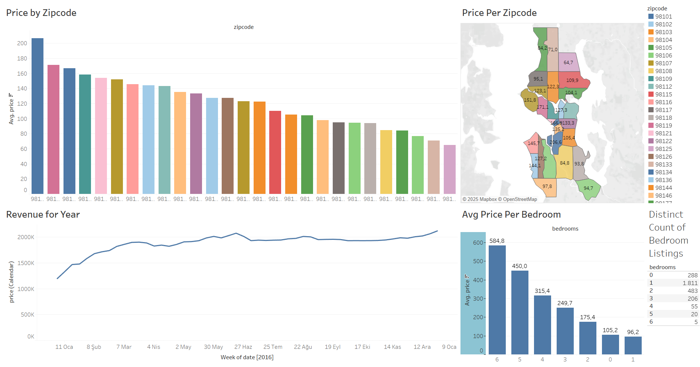

# Airbnb Tableau Dashboard

## 📊 Dashboard

## 🏠 Project Overview
An interactive dashboard built using Tableau to visualize Airbnb listings data. The goal is to uncover insights about location-based pricing, availability, and review scores.

## 🛠️ Tools & Techniques
- Tableau Public
- Dashboard Filters
- Map Visualization
- Time Series Analysis
- Calculated Fields

## 📊 Key Features
- Average price by location
- Room type distribution
- Review score trends over time
